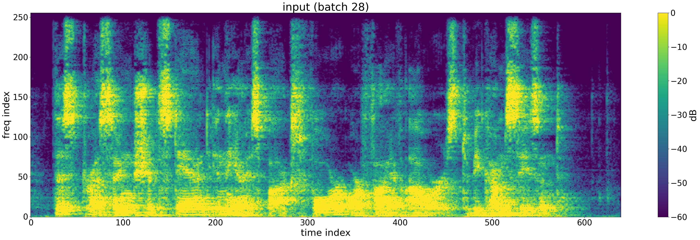
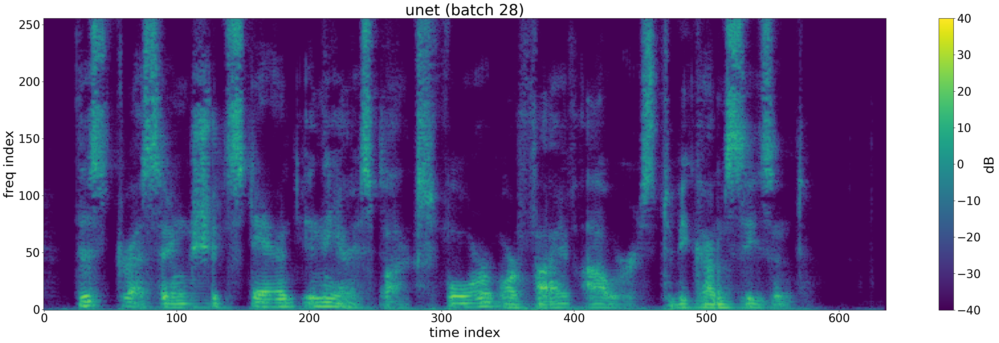

# speech-dereverb

U-Net speech dereverberation in Keras / TensorFlow. A 7-down/7-up convolutional U-Net operates on the log-magnitude STFT of 16 kHz speech to remove room reverb (and optionally clipping and additive noise). The STFT / ISTFT are custom Keras layers, so the model maps raw audio to raw audio end-to-end.

```
waveform --STFT--> log-polar --U-Net on log-magnitude--> recombine w/ phase --ISTFT--> waveform
```

## Example

Reverberant input (top) and the dereverbed output of the trained U-Net (bottom).

**Input** 

https://github.com/user-attachments/files/26752572/input.wav




<!-- INPUT_AUDIO_URL -->

**Output**

https://github.com/user-attachments/files/26752605/output.wav



<!-- OUTPUT_AUDIO_URL -->

## Install

Dependencies are pinned in [pyproject.toml](pyproject.toml) and [uv.lock](uv.lock). Create the environment with [uv](https://github.com/astral-sh/uv):

```sh
uv sync
```

Then either activate `.venv/` or prefix the commands below with `uv run`.

## Pipeline

The three scripts form a linear pipeline. `--ver prd` uses the full `train-clean-100` LibriSpeech split; `--ver dev` uses the small `dev-clean` split for quick iteration.

1. **Prepare data** — downloads MIT IR Survey impulse responses, LibriSpeech, and ESC-50 noise, then materializes degraded / clean wav pairs under `./datasets/dereverb/{train,val,test}-{ver}/{X,Y}/`:
   ```sh
   python prepare.py --ver prd
   ```
2. **Train** — fits the U-Net with `log_l2_loss` (MSE on log-magnitude STFTs). Writes the best checkpoint to `./checkpoints/dereverb-unet-{ver}.weights.h5`. Training uses `ReduceLROnPlateau` and `EarlyStopping`; pass `--resume` to continue from an existing checkpoint.
   ```sh
   python train.py --ver prd
   ```
3. **Render examples** — picks a random test batch and writes input / target / prediction spectrograms and wavs under `./demo_dereverb/example_*/`:
   ```sh
   python test.py --ver prd
   ```

After training, two extra tools are available:

- **`python eval.py --ver prd --split test`** — reports mean loss and SI-SNR (input, output, gain) over a split.
- **`python listen.py`** — interactive matplotlib viewer over `./demo_dereverb/`: toggles between input / output / target spectrograms and plays the wavs. On WSL, playback goes through `powershell.exe`'s `Media.SoundPlayer` so no Linux audio stack is needed.

## Repository layout

| File | Role |
| --- | --- |
| [train.py](train.py) | Custom STFT / ISTFT layers, U-Net builder, `log_l2_loss`, `PyDataset`, training loop |
| [prepare.py](prepare.py) | Downloads, resampling, and offline reverb / clipping / noise degradation |
| [test.py](test.py) | Overlap-add block inference and demo rendering |
| [eval.py](eval.py) | Loss and SI-SNR metrics on a split |
| [listen.py](listen.py) | Interactive viewer for rendered examples |
| [analyze.ipynb](analyze.ipynb) | Ad-hoc exploration notebook |

Sample rate is hard-coded to **16 kHz** throughout. The STFT layer drops the DC bin so the frequency dimension is a power of two (required by the 7-level U-Net). See [CLAUDE.md](CLAUDE.md) for architectural details and gotchas.

## Data sources

- **Speech** — [LibriSpeech](https://www.openslr.org/12/) (`dev-clean` or `train-clean-100`)
- **Impulse responses** — [MIT IR Survey](http://mcdermottlab.mit.edu/Reverb/IRMAudio/Audio.zip)
- **Noise** — [ESC-50](https://github.com/karoldvl/ESC-50)
